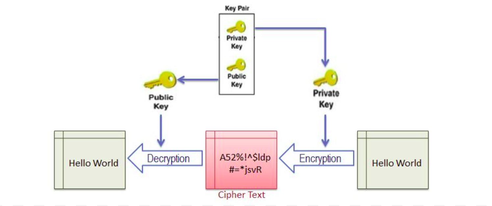

## Know about SSL

`Hello readers`,

In the previous article we learn about [what is CSR file](krishna-waidande.github.io/CSR) and we read that it is used to generate SSL certificates. Today we will see what is SSL? How it works?

### What is SSL?

SSL (Secure Sockets Layer) is a standard security protocol for establishing encrypted links between a web server and a browser in online communication.

The usage of SSL technology ensures that all data transmitted between the web server and browser remains encrypted.

An SSL certificate is necessary to create a SSL connection. You would need to give all details about the identity of your website and your company as and when you choose to activate SSL on your web server. 

### What is SSL used for?

The SSL protocol is used by millions of online business to protect their customers, ensuring their online transactions remain confidential. A web page should use encryption when it expects users to submit confidential data, including personal information, passwords, or credit card details. All web browsers have the ability to interact with secured sites so long as the site's certificate is issued by a trusted CA.

### How SSL works? 

SSL fundamentally works with the following concepts:

+ `Asymmetric Cryptography`
+ `Symmetric Cryptography`

### Asymmetric Cryptography

Asymmetric cryptography (also known as Asymmetric Encryption or Public Key Cryptography) uses a mathematically-related key pair to encrypt and decrypt data. In a key pair, one key is shared with anyone who is interested in communication. This is called Public Key. The other key in the key pair is kept secret and is called Private Key.

 

In the asymmetric cryptography, the data can be signed with a private key, which can only be decrypted using the related public key in a pair.

SSL uses asymmetric cryptography to initiate the communication which is known as SSL handshake. Most commonly used asymmetric key encryption algorithms include ElGamal, RSA, DSA, Elliptic curve techniques and PKCS.

### Symmetric Cryptography

In the symmetric cryptography, there is only one key which encrypts and decrypts the data. Both the sender and receiver should have this key, which is only known to them.

 

SSL uses symmetric cryptography using the session key after the initial handshake is done. The most widely used symmetric algorithms are AES-128, AES-192, and AES-256.

### How does SSL creates a secure connection?

The communication over SSL always begins with the `SSL handshake`. The SSL handshake is asymmetric cryptography which allows the browser to verify the web server, get the public key and establish a secure connection before the beginning of the actual data transfer.

1. The client sends a "client hello" message. This includes the client's SSL version number, cipher settings, session-specific data and other information that the server needs to communicate with the client using SSL.

2. The server responds with a "server hello" message. This includes the server's SSL version number, cipher settings, session-specific data, an SSL certificate with a public key and other information that the client needs to communicate with the server over SSL.

3. The client verifies the server's SSL certificate from CA (Certificate Authority) and authenticates the server. If the authentication fails, then the client refuses the SSL connection and throws an exception. If the authentication succeeds, then proceed to step 4.

4. The client creates a session key, encrypts it with the server's public key and sends it to the server. If the server has requested client authentication (mostly in server to server communication), then the client sends his own certificate to the server.

5. The server decrypts the session key with its private key and sends the acknowledgment to the client encrypted with the session key.

Thus, at the end of the SSL handshake, both the client and the server have a valid session key which they will use to encrypt or decrypt actual data. The public key and the private key will not be used any more after this.

### Actual data transferring

The client and the server now use a shared session key to encrypt and decrypt actual data and transfer it. This is done using the same session key at both ends and so, it is asymmetric cryptography. The actual SSL data transfer uses symmetric cryptography because it is easy and takes less CUP consumption compared with the asymmetric cryptography.

